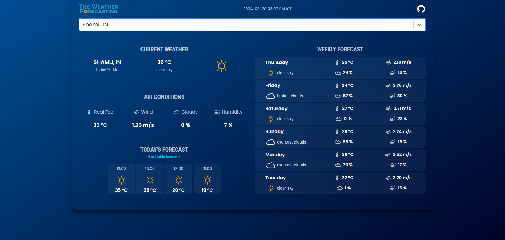

<br/>
<br/>

With [The Weather Forecasting](https://weather-forcasting-zeta.vercel.app/) user can search locations by city name and observe the weather for the next 5-6 days and 3 hour interval.
<br />
The app is developed using React.js and material-UI.

<br/>

## 💻 Live Demo:

https://weather-forcasting-zeta.vercel.app/

or 👇🏻  scan the QR code 


<br/>

## ✨ Run on localhost

- Make sure you already have `Node.js` and `npm` installed in your system.

- Clone the repository:

```bash
git clone https://github.com/ShailavMalik/Weather-Forcasting
```
<br>
         or (optionally) on top of github click on three dots and select download a zip file to download the repo to your local system.  (if git is not installed on your system)

<br>

- Install the packages using the command `npm install`

- Run the project on your localhost using `npm run start`

<br/>


<br/>

## 📙 Used libraries

- `React-Js`
- `Material-UI`

Check `packages.json` for details

<br/>

## 📄Future Enhancements: 

- On launch, find user location weather automatically
- Integration of any natural disaster prediction in the location.
- Integration of local time and international time in that location, we can add this using any Api.
-	We can add top weather headlines in the nearby locations as well.
- We can add last 10 days’ time line of weather forecasting of the selected location as well.
- Integration of future weather prediction using Machine learning technologies.


<br/>

Thank You ☺